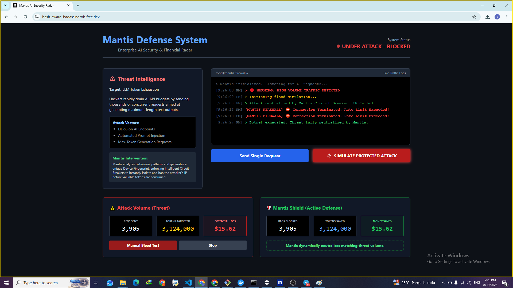
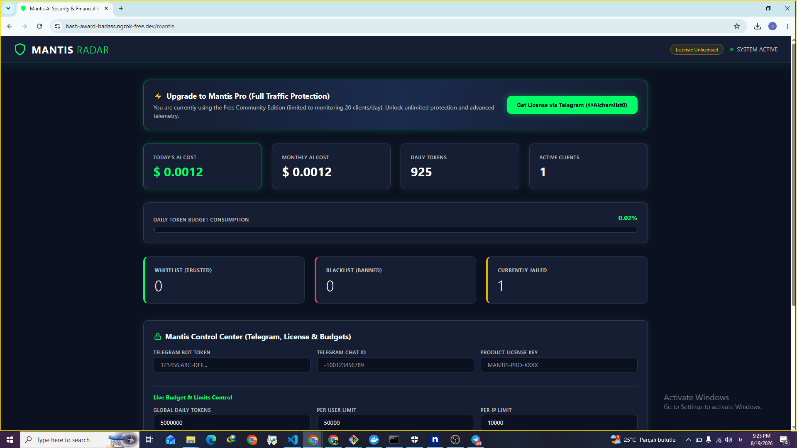

# 🛡️ MANTIS AI SECURITY & FINANCIAL RADAR

<p align="center">
  <strong>Enterprise-Grade Security Firewall, Token Budget Controller & Live Financial Radar for Laravel AI Applications.</strong>
</p>

<p align="center">
  <a href="#-the-problem--solution">The Problem</a> •
  <a href="#-live-defense-demo">Live Demo</a> •
  <a href="#-features">Features</a> •
  <a href="#-installation">Installation</a> •
  <a href="#-get-access">Get Access</a>
</p>

---

## 🛑 The Problem: Token Exhaustion & Budget Bleed
Have you ever watched a botnet or a rapid-fire attack drain your entire AI API budget (OpenAI, Groq, local LLMs) in just a few minutes? 
For developers and companies building AI-powered systems, unmitigated **Token Exhaustion** is a silent and expensive nightmare.

### 💡 The Solution: Mantis Shield
**Mantis** is an advanced security firewall and real-time financial radar. It intercepts malicious traffic, analyzes device fingerprints, triggers intelligent circuit breakers, and **saves your API budget in real-time** before a single valuable token is wasted.

---

## 🚀 Live Defense Demo
Watch how Mantis detects malicious flood traffic, enforces rate limits, and protects your capital instantly:

<video src="assets/2026-08-19-20-50-29.mp4" controls width="100%"></video>

---

## ✨ Core Features

* **Financial Guard & Token Budgets:** Set strict global, per-user, and per-IP daily/monthly token limits to completely eliminate unexpected API cost explosions.
* **Behavioral Engine & Threat Jailing:** Automatically isolates and jails malicious IPs the moment flood patterns or abuse are detected.
* **Mantis Shield (`X-Mantis-Device-Id`):** Advanced device fingerprinting and bot-detection headers.
* **Live Financial Radar Dashboard:** Real-time visual tracking showing potential financial losses vs. exact token costs saved by the shield.
* **Instant Alerts:** Integrated Telegram notifications for live attack tracking and security logs.
* **Encrypted Core:** Enterprise intellectual property protection via source code obfuscation.

---

## 📊 Dashboard Preview

### 1. Attack Simulation & Financial Impact


### 2. Main Control Center & Live Telemetry


---

## 📦 Installation & Quick Start

Require the package via Composer in your Laravel project:

```bash
composer require elctroalchemistt/mantis


Publish configuration and assets:

php artisan vendor:publish --tag=mantis-config

Add your environment variables to .env:

MANTIS_ENABLED=true
MANTIS_REDIS_CONNECTION=default
MANTIS_GLOBAL_DAILY_LIMIT=5000000
MANTIS_USER_DAILY_LIMIT=50000
MANTIS_IP_DAILY_LIMIT=10000


🎯 GET ACCESS & SPECIAL LAUNCH OFFER
Stop letting bots drain your AI infrastructure. Secure your application today!

🎁 Early Testers: We are currently offering Free 1-Month Access to a limited number of early adopters.

📬 Get in Touch: To claim your trial license, request enterprise setups, or get support, contact via Telegram: @Alchemiist0 or drop a message on LinkedIn.

🔒 License
Commercial security package. Protected intellectual property.
